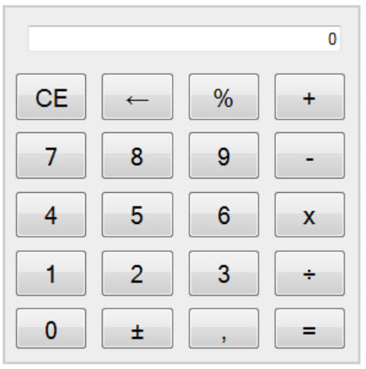

# Tarea 3.9. Creando elementos del DOM: Calculadora

## **Alumno: José Miguel Escribano Ruiz 2ºDAW-A**

Partiendo de un documento html vacío, crea los elementos HTML de una calculadora mediante los métodos del objeto predefinido document. Ni document.write() ni fichero.css están permitidos. Entrégala en este repositorio.

Sed eficientes y evitad la duplicación de código.

## Enlaces al código

- [index.html](index.html)
  
- [script.js](script.js)
